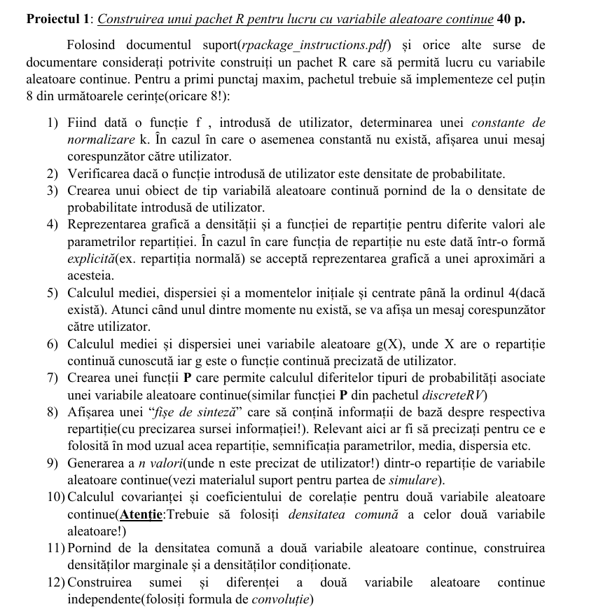

---
# Probabilitati si Statistica

## TODO

### Documentatie
* Numele membrilor
* Descrierea problemei
* Chestii pe care le-am folosit care depasesc nivelul cursului
* De mentionat daca folosim librarii externe sau ne-am inspirat de undeva
* Comentarii in cod
* Povestim unde au fost dificultati
* Concluzii
